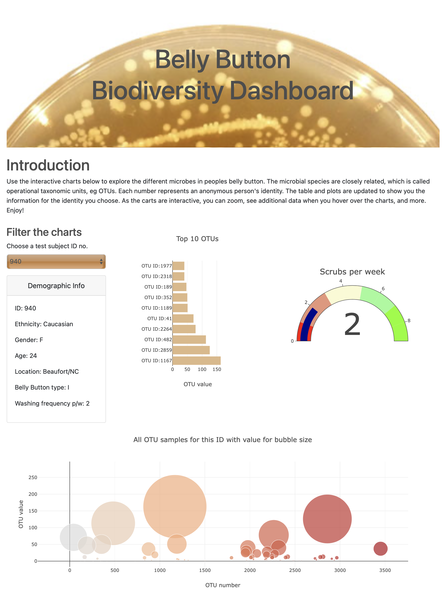

# Plotly
---
Plotly Homework - Belly Button Biodiversity

* Project with a given dataset to create a dashboard visualising operational taxonomic units (OTU's) in subjects belly buttons.
* The dashboard is created using HTML, CSS, Bootstrap, Plotly,  D3 and jQuery. 
* The dashboard includes a demographic card, horizontal bar chart, bubble chart and gauge.

